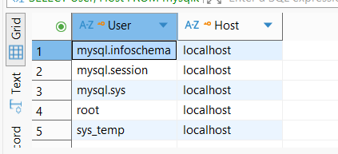
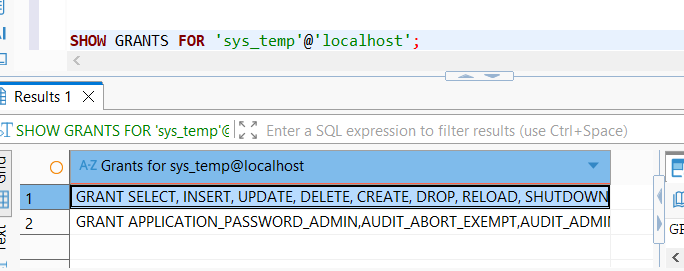
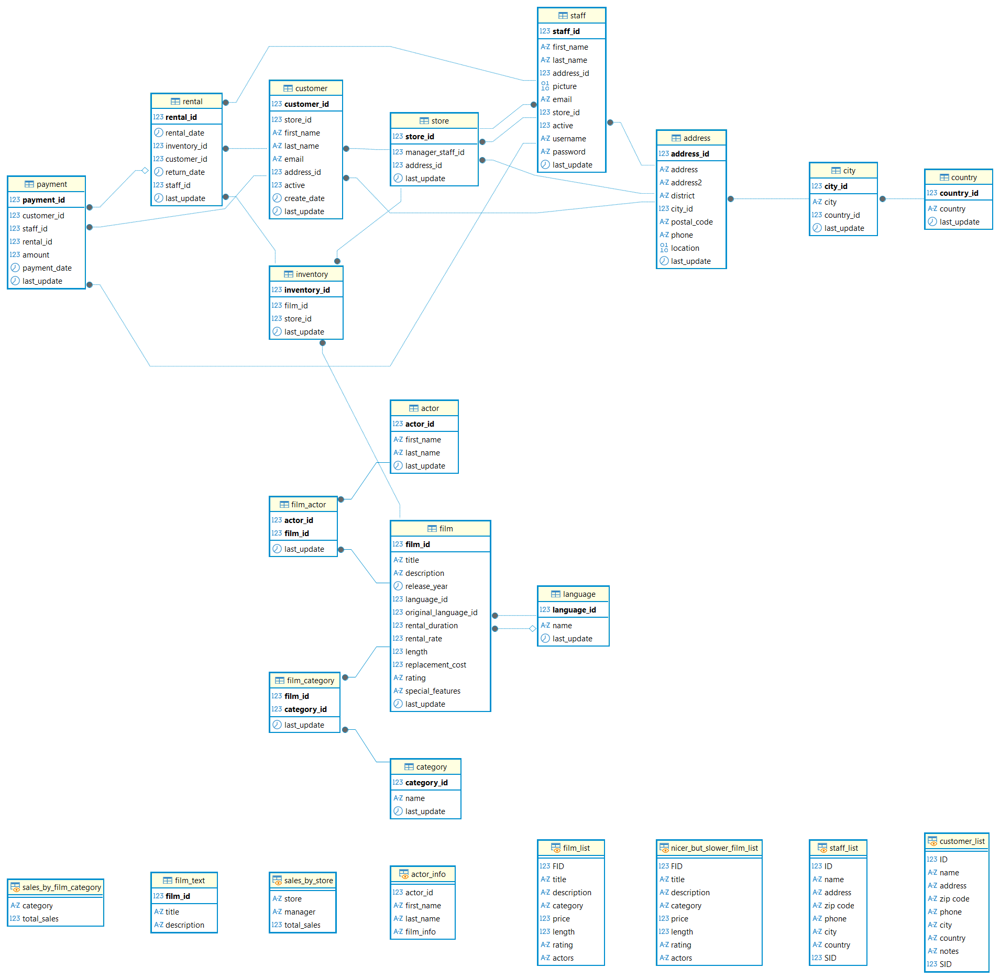
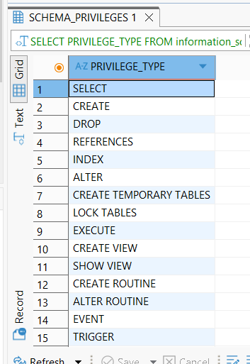

# Домашнее задание к занятию "`Работа с данными (DDL/DML)`" - `Еременко Анастасия`

### Задание 1

1. `Создание учетной записи:` 
    ALTER USER 'sys_temp'@'localhost' IDENTIFIED WITH mysql_native_password BY 'pass';
2. `Список пользователей в базе`
    
3. `Выдача прав пользователю:`
    GRANT ALL PRIVILEGES ON *.* TO 'sys_temp'@'localhost' WITH GRANT OPTION;
    FLUSH PRIVILEGES;
4. `Права sys_temp`
    
5. `Все таблицы и их ключи`
    

---

### Задание 2

|Название таблицы|Название первичного ключа|
|----------------|-------------------------|
|actor|actor_id|
|address|address_id|
|category|category_id|
|city|city_id|
|country|country_id|
|customer|customer_id|
|film|film_id|
|film_actor|actor_id|
|film_actor|film_id|
|film_category|film_id|
|film_category|category_id|
|film_text|film_id|
|inventory|inventory_id|
|language|language_id|
|payment|payment_id|
|rental|rental_id|
|staff|staff_id|
|store|store_id|

---

### Задание 3

`Приведите ответ в свободной форме........`

1. `Убрали права:`
    REVOKE INSERT, UPDATE, DELETE ON sakila.* FROM 'sys_temp'@'localhost';
    FLUSH PRIVILEGES;
2. `Итоговые права:`
   

